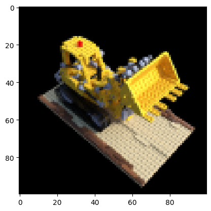
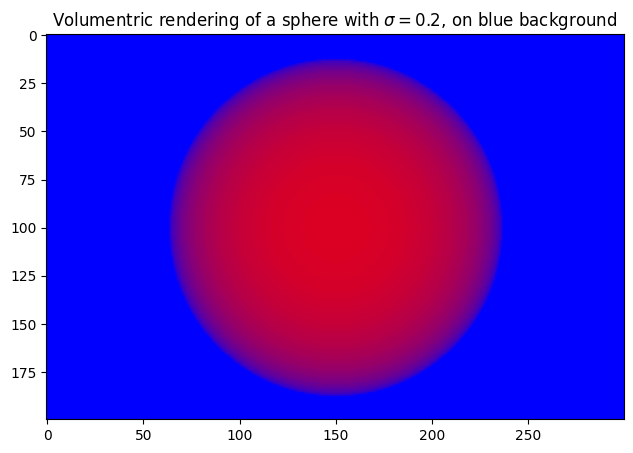
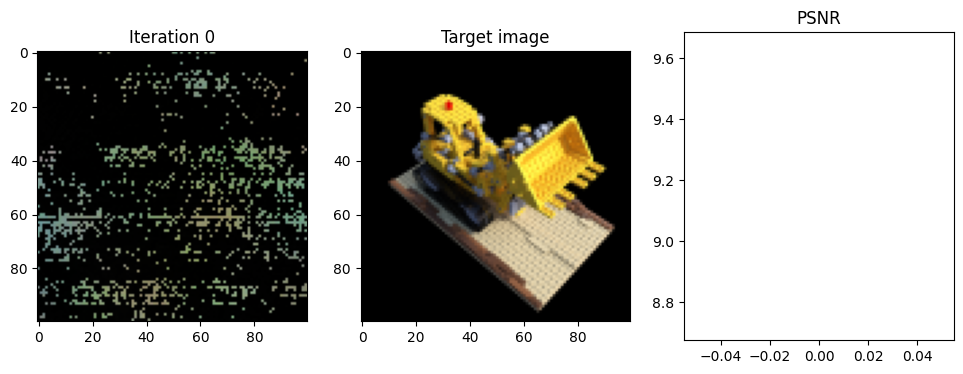
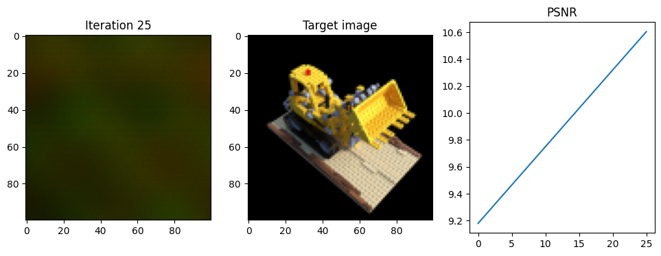
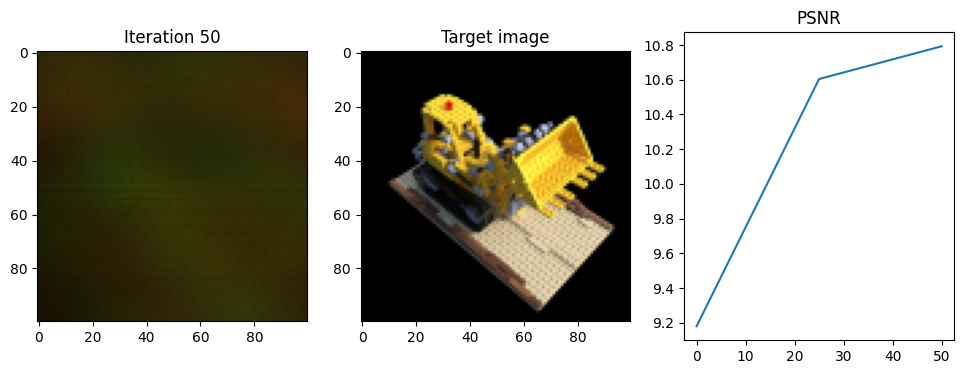
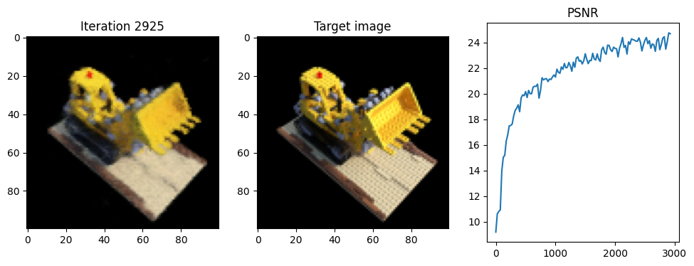
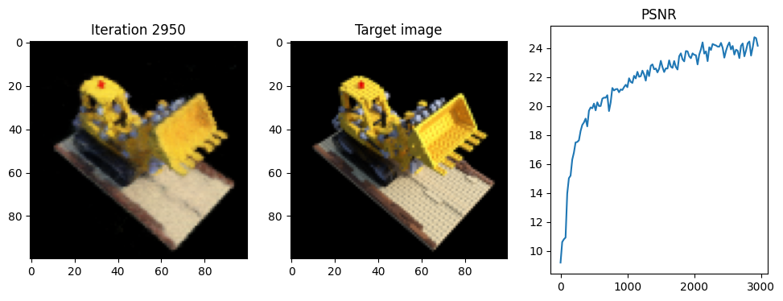
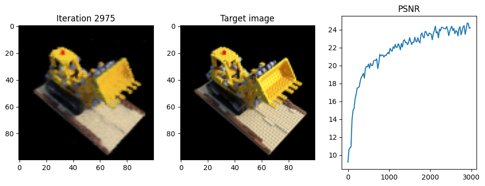
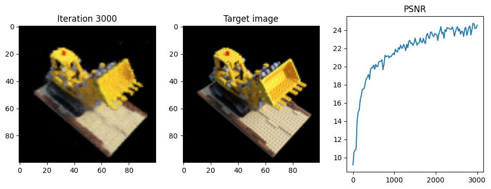

## CIS 580, Machine Perception, Fall 2023

### Part 2: Fitting a 3D Image


```python
import os
import gdown
import numpy as np
import torch
import torch.nn as nn
import matplotlib.pyplot as plt
import torch.nn.functional as F
import time

device = torch.device("cuda" if torch.cuda.is_available() else "cpu")
print(device)
```

    cuda


```python
url = "https://drive.google.com/file/d/13eBK_LWxs4SkruFKH7glKK9jwQU1BkXK/view?usp=sharing"
gdown.download(url=url, output='lego_data.npz', quiet=False, fuzzy=True)
```

    Downloading...
    From: https://drive.google.com/uc?id=13eBK_LWxs4SkruFKH7glKK9jwQU1BkXK
    To: /content/lego_data.npz
    100%|██████████| 12.7M/12.7M [00:00<00:00, 114MB/s]


    'lego_data.npz'


Here, we load the data that is comprised by the images, the R and T matrices of each camera position with respect to the world coordinates and the intrinsics parameters K of the camera.


```python
# Load input images, poses, and intrinsics
data = np.load("lego_data.npz")

# Images
images = data["images"]

# Height and width of each image
height, width = images.shape[1:3]

# Camera extrinsics (poses)
poses = data["poses"]
poses = torch.from_numpy(poses).to(device)
print(poses.shape)

# Camera intrinsics
intrinsics = data["intrinsics"]
intrinsics = torch.from_numpy(intrinsics).to(device)

# Hold one image out (for test).
test_image, test_pose = images[101], poses[101]
test_image = torch.from_numpy(test_image).to(device)

# Map images to device
images = torch.from_numpy(images[:100, ..., :3]).to(device)

plt.imshow(test_image.detach().cpu().numpy())
plt.show()

print(data)
```

    torch.Size([106, 4, 4])


    

    


    <numpy.lib.npyio.NpzFile object at 0x7dc691c9a530>


<details closed><summary>Positional Encoding</summary>

```python
def positional_encoding(x, num_frequencies=6, incl_input=True):

    """
    Apply positional encoding to the input.

    Args:
    x (torch.Tensor): Input tensor to be positionally encoded.
      The dimension of x is [N, D], where N is the number of input coordinates,
      and D is the dimension of the input coordinate.
    num_frequencies (optional, int): The number of frequencies used in
     the positional encoding (default: 6).
    incl_input (optional, bool): If True, concatenate the input with the
        computed positional encoding (default: True).

    Returns:
    (torch.Tensor): Positional encoding of the input tensor.
    """

    results = []
    if incl_input:
        results.append(x)
    #############################  TODO 1(a) BEGIN  ############################
    # encode input tensor and append the encoded tensor to the list of results.

    for i in range (num_frequencies):
      results.append(torch.sin((2**i)*np.pi*x))
      results.append(torch.cos((2**i)*np.pi*x))


    #############################  TODO 1(a) END  ##############################
    return torch.cat(results, dim=-1)
```
</details>

<!-- 2.1 Complete the following function that calculates the rays that pass through all the pixels of an HxW image -->

<details closed><summary>Get Rays</summary>

```python
def get_rays(height, width, intrinsics, w_R_c, w_T_c):

    """
    Compute the origin and direction of rays passing through all pixels of an image (one ray per pixel).

    Args:
    height: the height of an image.
    width: the width of an image.
    intrinsics: camera intrinsics matrix of shape (3, 3).
    w_R_c: Rotation matrix of shape (3,3) from camera to world coordinates.
    w_T_c: Translation vector of shape (3,1) that transforms

    Returns:
    ray_origins (torch.Tensor): A tensor of shape (height, width, 3) denoting the centers of
      each ray. Note that desipte that all ray share the same origin, here we ask you to return
      the ray origin for each ray as (height, width, 3).
    ray_directions (torch.Tensor): A tensor of shape (height, width, 3) denoting the
      direction of each ray.
    """

    device = intrinsics.device
    ray_directions = torch.zeros((height, width, 3), device=device)  # placeholder
    ray_origins = torch.zeros((height, width, 3), device=device)  # placeholder

    #############################  TODO 2.1 BEGIN  ##########################

    i, j = torch.meshgrid(torch.arange(width, device=device), torch.arange(height, device=device), indexing='xy')
    directions = torch.stack([(i - intrinsics[0, 2]) / intrinsics[0, 0],
                              (j - intrinsics[1, 2]) / intrinsics[1, 1],
                              torch.ones_like(i)], dim=-1)
    ray_directions = directions @ w_R_c.T
    ray_origins = w_T_c.expand(height, width, 3)

    #############################  TODO 2.1 END  ############################
    return ray_origins, ray_directions
```
</details>

Complete the next function to visualize how is the dataset created. You will be able to see from which point of view each image has been captured for the 3D object. What we want to achieve here, is to being able to interpolate between these given views and synthesize new realistic views of the 3D object.

<details closed><summary>Plot All Poses</summary>

```python
def plot_all_poses(poses):

    #############################  TODO 2.1 BEGIN  ############################

    for pose in poses:
        # w_R_c = pose[:3, :3]  # Extract rotation matrix
        # w_T_c = pose[:3, 3]   # Extract translation vector

        # Now call get_rays with all required arguments
        # origins, directions = get_rays(height, width, intrinsics, w_R_c, w_T_c)
        # origins, directions = get_rays(..., pose[:3, :3], pose[:3, 3])

    #############################  TODO 2.1 END  ############################

    ax = plt.figure(figsize=(12, 8)).add_subplot(projection='3d')
    _ = ax.quiver(origins[..., 0].flatten(),
                  origins[..., 1].flatten(),
                  origins[..., 2].flatten(),
                  directions[..., 0].flatten(),
                  directions[..., 1].flatten(),
                  directions[..., 2].flatten(), length=0.12, normalize=True)
    ax.set_xlabel('X')
    ax.set_ylabel('Y')
    ax.set_zlabel('z')
    plt.show()

print(data['poses'].shape)

plot_all_poses(data['poses'])
```
</details>


<!-- 2.2 Complete the following function to implement the sampling of points along a given ray. -->

<details closed><summary>Stratified Sampling</summary>

```python
def stratified_sampling(ray_origins, ray_directions, near, far, samples):

    """
    Sample 3D points on the given rays. The near and far variables indicate the bounds of sampling range.

    Args:
    ray_origins: Origin of each ray in the "bundle" as returned by the
      get_rays() function. Shape: (height, width, 3).
    ray_directions: Direction of each ray in the "bundle" as returned by the
      get_rays() function. Shape: (height, width, 3).
    near: The 'near' extent of the bounding volume.
    far:  The 'far' extent of the bounding volume.
    samples: Number of samples to be drawn along each ray.

    Returns:
    ray_points: Query 3D points along each ray. Shape: (height, width, samples, 3).
    depth_points: Sampled depth values along each ray. Shape: (height, width, samples).
    """

    #############################  TODO 2.2 BEGIN  ############################

    # depth_points = torch.linspace(near, far, samples, device=ray_origins.device)
    # ray_points = ray_origins[..., None, :] + ray_directions[..., None, :] * depth_points[..., None]

    # Calculate the t_i values for each sample.
    i_vals = torch.linspace(0, samples - 1, samples, device=ray_origins.device)
    t_i = near + (i_vals / (samples - 1)) * (far - near)

    # Reshape t_i to be broadcastable over the ray origins/directions.
    # The new shape of t_i will be [1, 1, samples], which can be broadcasted across the rays.
    depth_points = t_i.view(1, 1, samples)

    # Broadcast depth_points across the spatial dimensions (height and width)
    # and compute the 3D positions for each sampled point along the ray.
    ray_points = ray_origins[..., None, :] + depth_points[..., None] * ray_directions[..., None, :]

    # Now ray_points should have the shape [height, width, samples, 3]
    # depth_points should have the shape [1, 1, samples] which broadcasts correctly

    #############################  TODO 2.2 END  ############################
    return ray_points, depth_points
```
</details>

<!-- 2.3 Define the network architecture of NeRF along with a function that divided data into chunks to avoid memory leaks during training. -->

<details closed><summary>NeRF Model</summary>

```python
class nerf_model(nn.Module):

    """
    Define a NeRF model comprising eight fully connected layers and following the
    architecture described in the NeRF paper.
    """

    def __init__(self, filter_size=256, num_x_frequencies=6, num_d_frequencies=3):
        super().__init__()

        #############################  TODO 2.3 BEGIN  ############################
        # for autograder compliance, please follow the given naming for your layers
        self.layers = nn.ModuleDict({
            'layer_1': nn.Linear(3 + 2 * 3 * num_x_frequencies, filter_size),
            'layer_2': nn.Linear(filter_size, filter_size),
            'layer_3': nn.Linear(filter_size, filter_size),
            'layer_4': nn.Linear(filter_size, filter_size),
            'layer_5': nn.Linear(filter_size, filter_size),
            'layer_6': nn.Linear(filter_size + (3 + 2*3*num_x_frequencies), filter_size),
            'layer_7': nn.Linear(filter_size, filter_size),
            'layer_8': nn.Linear(filter_size, filter_size),
            'layer_s': nn.Linear(filter_size, 1),
            'layer_9': nn.Linear(filter_size, filter_size),
            'layer_10': nn.Linear(filter_size + 3 + 2*3*num_d_frequencies, 128),
            'layer_11': nn.Linear(128, 3)
        })

        #############################  TODO 2.3 END  ############################


    def forward(self, x, d):
        #############################  TODO 2.3 BEGIN  ############################
        # example of forward through a layer: y = self.layers['layer_1'](x)

        x1=F.relu(self.layers['layer_1'](x))
        x2=F.relu(self.layers['layer_2'](x1))
        x3=F.relu(self.layers['layer_3'](x2))
        x4=F.relu(self.layers['layer_4'](x3))
        x5=F.relu(self.layers['layer_5'](x4))
        x5 = torch.cat([x5, x], dim=-1)

        x6 = F.relu(self.layers['layer_6'](x5))
        x7 = F.relu(self.layers['layer_7'](x6))
        x8 = F.relu(self.layers['layer_8'](x7))

        sigma = self.layers['layer_s'](x8)

        x10 = self.layers['layer_9'](x8) # no relu here, it's a normal layer

        x10 = torch.cat([x10, d], dim=-1)

        x11 = F.relu(self.layers['layer_10'](x10))

        rgb = torch.sigmoid(self.layers['layer_11'](x11))


        #############################  TODO 2.3 END  ############################
        return rgb, sigma
```
</details>

<details closed><summary>Get Batches</summary>

```python
def get_batches(ray_points, ray_directions, num_x_frequencies, num_d_frequencies):

    def get_chunks(inputs, chunksize = 2**15):
        """
        This fuction gets an array/list as input and returns a list of chunks of the initial array/list
        """
        return [inputs[i:i + chunksize] for i in range(0, inputs.shape[0], chunksize)]

    """
    This function returns chunks of the ray points and directions to avoid memory errors with the
    neural network. It also applies positional encoding to the input points and directions before
    dividing them into chunks, as well as normalizing and populating the directions.
    """
    #############################  TODO 2.3 BEGIN  ############################

    ray_dir_magnitude = torch.sqrt(torch.sum(ray_directions ** 2, dim=2, keepdim=True))
    normalized_ray_dirs = ray_directions / ray_dir_magnitude

    # Adjust the shape of normalized ray directions to align with ray points
    # Ensuring the expanded directions have the same shape as in the working snippet
    normalized_ray_dirs_expanded = normalized_ray_dirs.unsqueeze(2).expand(-1, -1, ray_points.size(2), -1)

    # Flatten the ray directions and points
    flattened_ray_dirs = normalized_ray_dirs_expanded.reshape(-1, 3)
    flattened_ray_points = ray_points.reshape(-1, 3)

    # Apply positional encoding
    encoded_dirs = positional_encoding(flattened_ray_dirs, num_d_frequencies)
    encoded_points = positional_encoding(flattened_ray_points, num_x_frequencies)

    # Divide the encoded data into manageable chunks
    ray_directions_batches = get_chunks(encoded_dirs)
    ray_points_batches = get_chunks(encoded_points)


    #############################  TODO 2.3 END  ############################

    return ray_points_batches, ray_directions_batches
```
</details>

<!-- 2.4 Compute the compositing weights of samples on camera ray and then complete the volumetric rendering procedure to reconstruct a whole RGB image from the sampled points and the outputs of the neural network. -->

<details closed><summary>Volumetric Rendering</summary>

```python
def volumetric_rendering(rgb, s, depth_points):

    """
    Differentiably renders a radiance field, given the origin of each ray in the
    "bundle", and the sampled depth values along them.

    Args:
    rgb: RGB color at each query location (X, Y, Z). Shape: (height, width, samples, 3).
    sigma: Volume density at each query location (X, Y, Z). Shape: (height, width, samples).
    depth_points: Sampled depth values along each ray. Shape: (height, width, samples).

    Returns:
    rec_image: The reconstructed image after applying the volumetric rendering to every pixel.
    Shape: (height, width, 3)
    """

    #############################  TODO 2.4 BEGIN  ############################

    depth_differences = depth_points[..., 1:] - depth_points[..., :-1]

# Handle the 'infinite' distance for the last segment more uniformly
    infinite_distance = torch.full_like(depth_differences[..., :1], fill_value=1e10)
    depth_differences = torch.cat([depth_differences, infinite_distance], dim=-1)

    # Ensure non-negativity of the density (s) if required
    s = F.relu(s)

    # Calculate the opacity (alpha) for each sampled point
    alphas = 1.0 - torch.exp(-s * depth_differences)

    # Simplify the transmittance calculation
    # Initialize the first value to 1 (fully transparent) and then calculate the cumulative product
    transmittance = torch.cat([torch.ones_like(alphas[..., :1]), 1 - alphas], dim=-1)
    transmittance = torch.cumprod(transmittance, dim=-1)[..., :-1]

    # Determine the contribution of each point to the final color
    weighted_colors = rgb * alphas[..., None] * transmittance[..., None]

    # Integrate the contributions along each ray to determine pixel colors
    rec_image = torch.sum(weighted_colors, dim=-2)

    #############################  TODO 2.4 END  ############################

    return rec_image
```
</details>

To test and visualize your implementation, independently of the previous and next steps of the
NeRF pipeline, you can load the sanity_volumentric.pt file, run your implementation of the volumetric function and expect to see the figure provided in the handout.


```python
url = "https://drive.google.com/file/d/1ag6MqSh3h4KY10Mcx5fKxt9roGNLLILK/view?usp=sharing"
gdown.download(url=url, output='sanity_volumentric.pt', quiet=False, fuzzy=True)
rbd = torch.load('sanity_volumentric.pt')
```

    Downloading...
    From: https://drive.google.com/uc?id=1ag6MqSh3h4KY10Mcx5fKxt9roGNLLILK
    To: /content/sanity_volumentric.pt
    100%|██████████| 120M/120M [00:00<00:00, 234MB/s] 


```python
r = rbd['rgb']
s = rbd['sigma']
depth_points = rbd['depth_points']
rec_image = volumetric_rendering(r, s, depth_points)

plt.figure(figsize=(10, 5))
plt.imshow(rec_image.detach().cpu().numpy())
plt.title(f'Volumentric rendering of a sphere with $\\sigma={0.2}$, on blue background')
plt.show()
```


    

    


2.5 Combine everything together. Given the pose position of a camera, compute the camera rays and sample the 3D points along these rays. Divide those points into batches and feed them to the neural network. Concatenate them and use them for the volumetric rendering to reconstructed the final image.

<details closed><summary>One Forward Pass</summary>

```python
def one_forward_pass(height, width, intrinsics, pose, near, far, samples, model, num_x_frequencies, num_d_frequencies):

    #############################  TODO 2.5 BEGIN  ############################

    #compute all the rays from the image
    w_R_c, w_T_c = pose[:3, :3], pose[:3, 3]
    ray_origins, ray_directions = get_rays(height, width, intrinsics, w_R_c, w_T_c)


    #sample the points from the rays
    ray_points, depth_points = stratified_sampling(ray_origins, ray_directions, near, far, samples)


    #divide data into batches to avoid memory errors
    ray_points_batches, ray_directions_batches = get_batches(ray_points, ray_directions, num_x_frequencies, num_d_frequencies)

    all_rgb = []
    all_s = []

    # Step 4: Forward pass the batches and concatenate the outputs at the end
    for batch_points, batch_directions in zip(ray_points_batches, ray_directions_batches):
        batch_points = batch_points.view(-1, batch_points.shape[-1])  # Flatten the batch for processing
        batch_directions = batch_directions.view(-1, batch_directions.shape[-1])  # Flatten the batch for processing
        rgb, s = model(batch_points, batch_directions)  # Forward pass through the model
        all_rgb.append(rgb)
        all_s.append(s)

    # Reshape and concatenate the outputs
    all_rgb = torch.cat(all_rgb, dim=0).view(height, width, samples, 3)
    all_s = torch.cat(all_s, dim=0).view(height, width, samples)

    # Step 5: Apply volumetric rendering to obtain the reconstructed image
    rec_image = volumetric_rendering(all_rgb, all_s, depth_points)


    #############################  TODO 2.5 END  ############################

    return rec_image
```
</details>

If you manage to pass the autograder for all the previous functions, then it is time to train a NeRF! We provide the hyperparameters for you, we initialize the NeRF model and its weights, and we define a couple lists that will be needed to store results.


```python
num_x_frequencies = 10
num_d_frequencies = 4
learning_rate  = 5e-4
iterations = 3000
samples = 64
display = 25
near = 0.667
far = 2

model = nerf_model(num_x_frequencies=num_x_frequencies,num_d_frequencies=num_d_frequencies).to(device)

def weights_init(m):
    if isinstance(m, torch.nn.Linear):
        torch.nn.init.xavier_uniform_(m.weight)
model.apply(weights_init)

optimizer = torch.optim.Adam(model.parameters(), lr=learning_rate)

psnrs = []
iternums = []

t = time.time()
t0 = time.time()
```


```python
import tqdm
for i in tqdm.tqdm(range(iterations+1)):

    #############################  TODO 2.6 BEGIN  ############################

    #choose randomly a picture for the forward pass
    rand = torch.randint(0, images.shape[0]-1,(1,)).item()
    image = images[rand].to(device)
    pose = poses[rand].to(device)
    intrinsics = intrinsics.to(device)


    # Run one iteration of NeRF and get the rendered RGB image.
    rec_image = one_forward_pass(height, width, intrinsics, pose, near, far, samples, model, num_x_frequencies, num_d_frequencies).to(device)


    # Compute mean-squared error between the predicted and target images. Backprop!
    optimizer.zero_grad()
    loss = torch.nn.functional.mse_loss(rec_image, image)
    loss.backward()
    optimizer.step()

    #############################  TODO 2.6 END  ############################

    # Display images/plots/stats
    if i % display == 0:
        with torch.no_grad():
          #############################  TODO 2.6 BEGIN  ############################
          # Render the held-out view

          test_rec_image = one_forward_pass(height, width, intrinsics, test_pose, near, far, samples, model, num_x_frequencies, num_d_frequencies).to(device)
          #calculate the loss and the psnr between the original test image and the reconstructed one.
          test_loss = torch.nn.functional.mse_loss(test_rec_image, test_image)
          psnr = 10.0 * torch.log10(1.0 / test_loss)


          #############################  TODO 2.6 END  ############################

        print("Iteration %d " % i, "Loss: %.4f " % loss.item(), "PSNR: %.2f " % psnr.item(), \
                "Time: %.2f secs per iter, " % ((time.time() - t) / display), "%.2f mins in total" % ((time.time() - t0)/60))

        t = time.time()
        psnrs.append(psnr.item())
        iternums.append(i)

        plt.figure(figsize=(16, 4))
        plt.subplot(141)
        plt.imshow(test_rec_image.detach().cpu().numpy())
        plt.title(f"Iteration {i}")
        plt.subplot(142)
        plt.imshow(test_image.detach().cpu().numpy())
        plt.title("Target image")
        plt.subplot(143)
        plt.plot(iternums, psnrs)
        plt.title("PSNR")
        plt.show()

plt.imsave('test_lego.png',test_rec_image.detach().cpu().numpy())
torch.save(model.state_dict(),'model_nerf.pt')
print('Done!')
```

      0%|          | 0/3001 [00:00<?, ?it/s]

    Iteration 0  Loss: 0.0997  PSNR: 9.18  Time: 0.17 secs per iter,  0.07 mins in total


    

    


      1%|          | 25/3001 [00:21<40:19,  1.23it/s]

    Iteration 25  Loss: 0.0411  PSNR: 10.60  Time: 0.84 secs per iter,  0.42 mins in total


    

    


      2%|▏         | 50/3001 [00:43<41:01,  1.20it/s]

    Iteration 50  Loss: 0.0574  PSNR: 10.79  Time: 0.87 secs per iter,  0.78 mins in total


    

    


      2%|▏         | 75/3001 [01:05<41:57,  1.16it/s]

    Iteration 75  Loss: 0.0680  PSNR: 10.91  Time: 0.89 secs per iter,  1.15 mins in total


    


    

    


     98%|█████████▊| 2950/3001 [42:32<00:41,  1.22it/s]

    Iteration 2950  Loss: 0.0022  PSNR: 24.17  Time: 0.87 secs per iter,  42.59 mins in total


    

    


     99%|█████████▉| 2975/3001 [42:53<00:21,  1.22it/s]

    Iteration 2975  Loss: 0.0036  PSNR: 24.23  Time: 0.86 secs per iter,  42.95 mins in total


    

    


    100%|█████████▉| 3000/3001 [43:15<00:00,  1.22it/s]

    Iteration 3000  Loss: 0.0026  PSNR: 24.56  Time: 0.86 secs per iter,  43.31 mins in total


    

    


    100%|██████████| 3001/3001 [43:17<00:00,  1.16it/s]

    Done!


    

